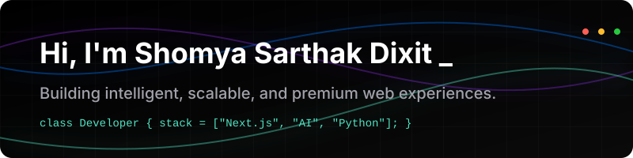

<div align="center">
  
</div>

<h1 align="center">
  <a href="https://git.io/typing-svg">
    
  </a>
</h1>

<p align="center">
  <em>Second-year B.Tech Computer Science student at KL University crafting premium digital products.</em>
</p>

<div align="center">
  <a href="https://linkedin.com/in/shomyasarthakdixit-gif"></a>
  <a href="mailto:your.email@example.com"></a>
</div>

<br />

## 👨‍💻 Developer Identity

```javascript
class Shomya extends SoftwareEngineer {
  constructor() {
    super();
    this.name = "Shomya Sarthak Dixit";
    this.education = "KL University (B.Tech CSE)";
    this.currentFocus = ["Next.js", "AI Integrations", "System Design"];
  }
  
  getMission() {
    return "To build software that is intelligent, performant, and beautifully engineered.";
  }
}
```

## 🛠️ Tech Stack & Tools

### Languages


### Frontend & Backend


### Databases & Tools


---

## 📈 GitHub Analytics

<div align="center">
  
  
</div>
<br />
<div align="center">
  
</div>

---

## 🐍 Contribution Graph

<div align="center">
  
</div>

---

<p align="center">
  
</p>
